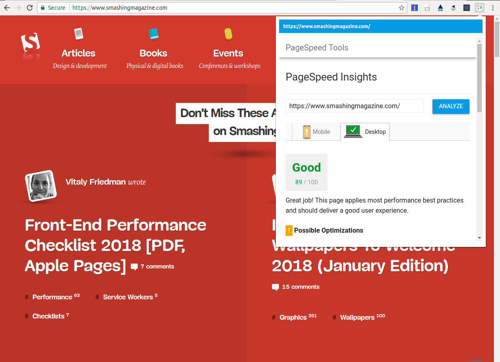

# Google PageSpeed Chrome Extension

The extension adds an icon to the toolbar so you can get Google PageSpeed loaded into the extension popup with just one click.

## Benefits
The extension saves you time as you don't need to copy/paste the link and open Google PageSpeed page in your browser.

## Look and feel


## Installation

1. Download the files
```
git clone https://github.com/22nds/chrome_extension_pagespeed.git
```
or download and unpack the [zip file](https://github.com/22nds/chrome_extension_pagespeed/archive/master.zip)

2. Open `chrome://extensions/`
3. Click on `Load unpackaged extension...` and select the downloaded directory.